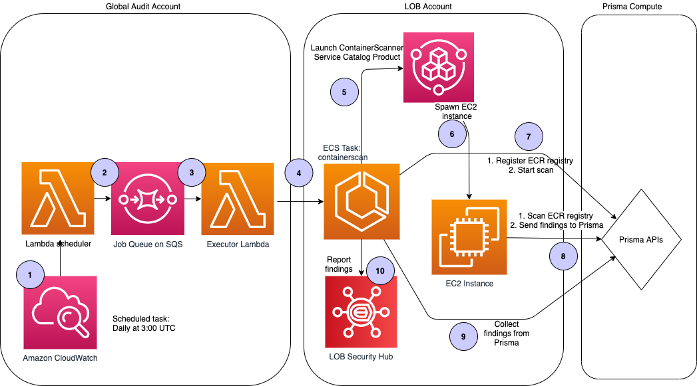

# cirrus-scan-containerscan

CirrusScan check: Container Scanner

[CirrusScan](https://github.secureserver.net/appservices/CirrusScan) utilizes
[Prisma Cloud Container Defender](https://docs.paloaltonetworks.com/prisma/prisma-cloud/prisma-cloud-admin-compute/install/install_defender/install_single_container_defender.html) to identify compliance violations and vulnerabilities in container images in AWS ECR registries. Findings are forwarded to
[Security Hub](https://docs.aws.amazon.com/securityhub/latest/userguide/) for presentation.

Refer to [docker/README.md](docker/README.md) for details on how to construct
and promote the container used for scanning. Note that all tailoring is
performed at container build time.

# Prisma Cloud Container Defender

Prisma is Godaddy's chosen vendor for performing container image compliance and vulnerability scans in the cloud. Prisma Cloud allows admin users to configure compliance and vulnerabilitiy policy and rules used by different scan processes either through the admin console, or through APIs.

Prisma Cloud Container Defender covers compliance and vulnerability scans for images in ECR registries by enforcing policy rules configured in Prisma admin console.


# Workflow



Container scans are invoked by CirrusScan **CloudWatch Daily rule**, which runs everyday at **8 PM (MST)** on all AWS accounts.

Next, the CirrusScan Scheduler lambda in the "Audit" account looks at the incoming scan request, and pushes messages in SQS queue. The Executor lambda picks up these requests and registers ECS task definitions in each of the target LOB accounts.

When a container scan is requested, the following activities take place:

1. CirrusScan will execute an ECS task in the specified AWS account to coordinate the scan.
2. If there are repos in the ECR registry in the region, the ECS task will provision an ephemeral EC2 using service catalog product "containerscanner" which will install a Prisma Cloud container defender instance.
3. Once the provisioning is complete, the ECS task will register the ECR registry with Prisma Cloud console and request the registry to be scanned.
4. Once scan is complete, the ECS task will retrieve scan results from Prism Cloud console through API.
5. The raw data will be examined for nonconformances. A SecurityHub compliance finding will be generated for each container image in ECR repo. A Security Hub vulnerability finding will be generated for all vulnerabilities related to a product for each container image. Where available, this finding will be enriched with CI identification and the supporting ServiceNow oncall team.
6. CirrusScan libraries transparently correlate these findings with earlier observations, resulting in the automatic creation, update or archiving of Security Hub findings as appropriate. (CirrusScan subsequently forwards these  findings to ServiceNow, opening or closing tickets as required.)
7. The ECS task stores output and status data in S3 for further review.
8. The ephemeral EC2 created for the scan will be unprovisioned.
9. The ECS task terminates.

## Logging and Debugging

To find debugging logs from the container, go to Cloudwatch logs, and
filter logs by **/ecs/containerscan**. You should see the debugging logs from the
containerscan container in the most recent log stream. Please verify the last event time.

## Security Findings

By design, all containerscan findings are created with severity **HIGH** or **CRITICAL**.
Findings generated by this check can be found by applying following filters on
Security Hub:

* Record State _EQUALS_ ACTIVE
* ID _PREFIX_ containerscan/

For any further assistance, please reach out to DL-AppSecurity@godaddy.com.

## Development

### Environment Setup

```bash
$ python3 -m venv .venv
$ source .venv/bin/activate # Activate virtualenv
(.venv) $ pip install --upgrade pip
(.venv) $ pip install -r requirements.txt
(.venv) $ pre-commit install --install-hooks
(.venv) $ deactivate # if desired
```

### Unit Testing

```bash
$ python3 -m venv .venv
$ source .venv/bin/activate # Activate virtualenv
(.venv) $ pip install --upgrade pip
(.venv) $ pip install -r requirements.txt
(.venv) $ pytest # This will provide terminal output.
(.venv) $ coverage html && open ./dist/index.html # To create html report & open it in browser.
```
